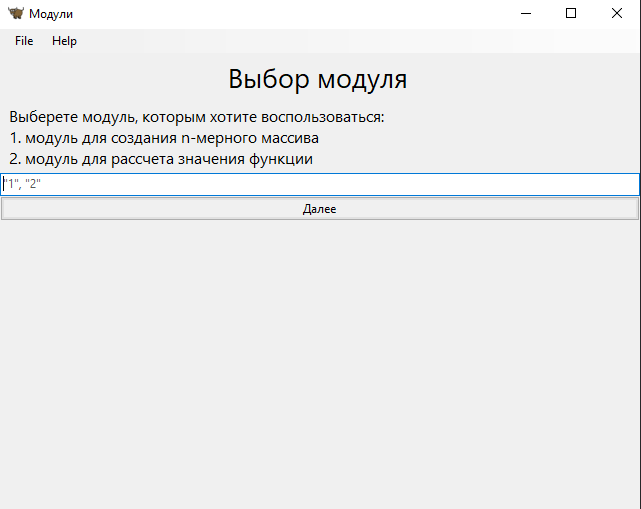
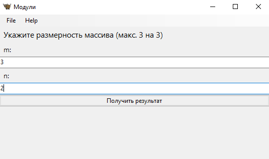
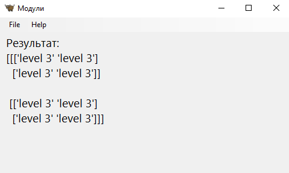
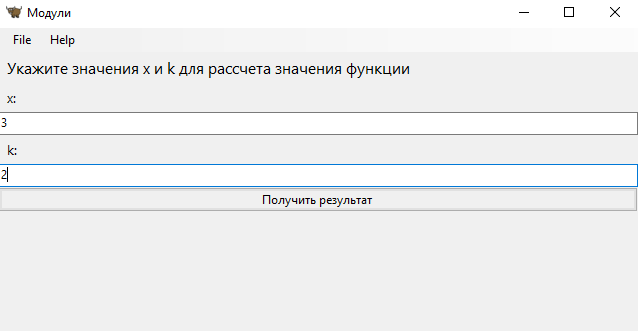
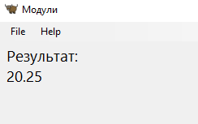

# Прог. Лабораторная работа №10
## Задание
1. Создать пакет, содержащий модули на основе лабораторных работ 7-9
2. написать запускающий модуль на основе [Typer](https://typer.tiangolo.com), 
который позволит выбирать и настраивать параметры запуска логики из пакета.
3. Оформить отчет в ```readme.md```, который должен содержать:
    - условия задач
    - описание проделанной работы
    - скриншоты результатов
    - ссылки на используемые материалы

## Medium
- Реализовать GUI приложение на одном из актуальных фреймворков

## Решение

Для реализации приложения был выбран фреймворк Toga.
Пакет модулей `modules` содержит следующие модули:   
- ```nd_array``` создает n-мерные массивы
- ```function``` рассчитывает $y_k = b_k \cdot y_{k-1}$. $y_0 = 1$, $b_k = b_{k-1} x^2$, 
$b_0 = \frac{1}{2x}$, $x \neq 0$.

### Модули
`function.py`
```Python
class Calc:
    def __init__(self, x, k):
        self.x = x
        self.k = k

    def y(self):
        if self.x == 0:
            raise ValueError('x should not be 0')

        y_0 = 1
        b_0 = 1 / (2 * self.x)
        y_k = 0
        for i in range(1, self.k+1):
            b_k = b_0 * self.x**2
            y_k = b_k * y_0

            y_0 = y_k
            b_0 = b_k

        return y_k
```

`nd_array.py`
```Python
import numpy as np


class Calc:
    def __init__(self, m, n):
        self.m = m
        self.n = n

    def create_n_dim_array(self):
        arr = []
        string = [f'level {self.m}']
        if self.m == 1:
            return string * self.n
        elif self.m == 2:
            for i in range(self.n):
                arr.append(string * self.n)
            return arr
        elif self.m == 3:
            arr = np.full((self.n, self.n, self.n), string)
            return arr
```


### Код приложения
```Python
import toga
from lab_10.medium.modules import function, nd_array
from toga.style.pack import COLUMN, Pack


class My_App(toga.App):

    def startup(self):
        main_box = toga.Box(style=Pack(direction=COLUMN))

        main_box.add(toga.Label("Выбор модуля", style=Pack(padding=5, text_align='center', font_size=20)))
        main_box.add(toga.Label("Выберете модуль, которым хотите воспользоваться:\n"
                                "1. модуль для создания n-мерного массива\n"
                                "2. модуль для рассчета значения функции\n", style=Pack(padding=5, font_size=12)))
        main_box.add(toga.TextInput(placeholder='"1", "2"',
                                    on_change=self.widget_value))   # введенное слово принимает функция widget_value
        main_box.add(toga.Button('Далее', on_press=self.next_window))  # при нажатии кнопки вызывается функция
                                                                       # next_window

        self.main_window = toga.MainWindow()
        self.main_window.content = main_box
        self.main_window.show()

    def widget_value(self, widget):
        self.wv = widget.value

    def next_window(self, widget):
        w_values = ['1', '2']
        if widget.text == 'Далее' and (self.wv in w_values):
            self.to_input_values()

    # создает окно, в котором пользователь вводит необходимые данные, их получает функция received_values
    def to_input_values(self):
        box = toga.Box(style=Pack(direction=COLUMN))
        if self.wv == '1':
            box.add(toga.Label("Укажите размерность массива (макс. 3 на 3)", style=Pack(padding=5, font_size=12)))
            box.add(toga.Label("m:", style=Pack(padding=5, font_size=10)))
            box.add(toga.TextInput(placeholder='m', on_change=self.received_values))

            box.add(toga.Label("n:",
                               style=Pack(padding=5, font_size=10)))
            box.add(toga.TextInput(placeholder='n', on_change=self.received_values))

        elif self.wv == '2':
            box.add(toga.Label("Укажите значения x и k для рассчета значения функции", style=Pack(padding=5,
                                                                                                  font_size=12)))
            box.add(toga.Label("x:", style=Pack(padding=5, font_size=10)))
            box.add(toga.TextInput(placeholder='x', on_change=self.received_values))

            box.add(toga.Label("k:",
                               style=Pack(padding=5, font_size=10)))
            box.add(toga.TextInput(placeholder='k', on_change=self.received_values))

        box.add(toga.Button('Получить результат', on_press=self.calculation))

        self.main_window.content = box

    def received_values(self, widget):
        if widget.placeholder == 'm':
            self.m = int(widget.value)
        elif widget.placeholder == "n":
            self.n = int(widget.value)
        elif widget.placeholder == 'x':
            self.x = int(widget.value)
        elif widget.placeholder == 'k':
            self.k = int(widget.value)

    # производит расчеты, пользуясь подключенными для этого модулями и выводит их в новом созданном окне
    def calculation(self, *args, **kwargs):
        global res, r
        box = toga.Box(style=Pack(direction=COLUMN))
        if self.wv == '1':
            c = nd_array.Calc(self.m, self.n)
            res = c.create_n_dim_array()
        elif self.wv == '2':
            c = function.Calc(self.x, self.k)
            res = c.y()

        box.add(toga.Label(f"Результат: \n"
                           f"{res}", style=Pack(padding=5, font_size=14)))

        self.main_window.content = box


def main():
    return My_App("Модули", "org.beeware.toga.tutorial")


if __name__ == "__main__":
    main().main_loop()
```

### Запуск приложения
Начальное окно:   


#### Выбираем первый модуль
Вводим в поле ввода начального окна значение "1". После нажатия кнопки "Далее" открывается следующее окно, в полях которого
мы вводим необходимые значения:    


Нерекурсивная функция, содержащаяся в модуле для создания n-мерных массивов, для многомерных массивов будет правильно работать только тогда, 
когда в ней прописаны случаи для конкретных, заранее определенных количеств измерений. Поэтому, для того чтобы не возникало ошибки при 
вводе пользователем значений, были дополнительно обозначены максимальные значения, которые пользователь может ввести.   

Нажимаем на кнопку "Получить результат":    


#### Выбираем второй модуль
Вводим в поле ввода начального окна значение "2". После нажатия кнопки "Далее" открывается следующее окно, в полях которого
мы вводим необходимые значения:    


Нажимаем на кнопку "Получить результат":  

