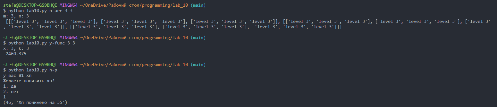
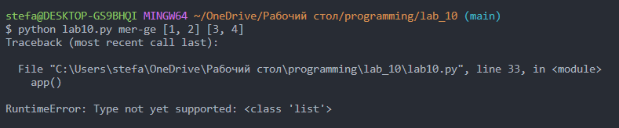

# Прог. Лабораторная работа №10
## Задание
1. Создать пакет, содержащий 3 модуля на основе лабораторных работ 7-9
2. написать запускающий модуль на основе [Typer](https://typer.tiangolo.com), 
который позволит выбирать и настраивать параметры запуска логики из пакета.
3. Оформить отчет в ```readme.md```, который должен содержать:
    - условия задач
    - описание проделанной работы
    - скриншоты результатов
    - ссылки на используемые материалы

## Решение

На основе лаб-х работ 7-9 был создан пакет ```moduls``` c модулями ```nd_array```, ```function```, 
```character_s_hp```, ```merger```.
- ```nd_array``` создает n-мерные массивы
- ```function``` рассчитывает $y_k = b_k \cdot y_{k-1}$. $y_0 = 1$, $b_k = b_{k-1} x^2$, 
$b_0 = \frac{1}{2x}$, $x \neq 0$.
- ```character_s_hp``` работает с хп персонажа, понижая или повышая его
- ```merger``` объединяет заданные пользователем последовательности

```Python
import typer

from moduls import character_s_hp, funtion, nd_array

app = typer.Typer()


@app.command()
def n_arr(m: int, n: int):
    print(f'm: {m}, n: {n}\n', nd_array.create_n_dim_array(m, n))


@app.command()
def y_func(k: int, x: int):
    print(f'x: {x}, k: {k}\n', funtion.y(k, x))


@app.command()
def h_p():
    print(character_s_hp.hp())


if __name__ == "__main__":
    app()
```

Вывод:



При попытке запуска функции из лабораторной работы 9, принимающей списки, выводится ошибка:



Поэтому она была исключена.

## Используемые материалы

[Typer](https://typer.tiangolo.com)

