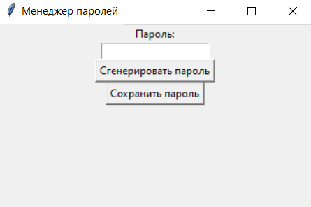
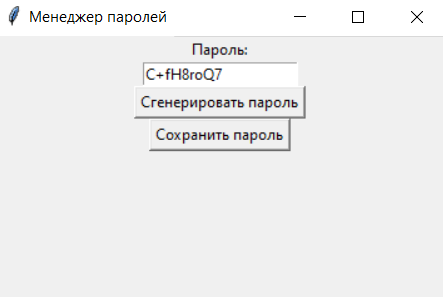
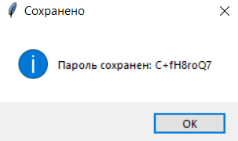
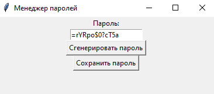
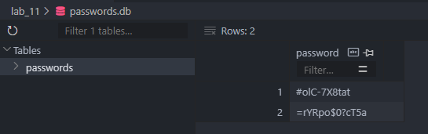

# Прог. Лабораторная работа №11
## Задание
1. Реализовать приложение с GUI (приложения-игры допускается делать с использованием TUI-пакетов) по своему варианту.
Список GUI фреймворков:
    - appJar
    - Tkinter
    - Flet
    - wxPython
    - PySimpleGUI
    - Pyforms
    - Toga
    - PyGObject
    - guizero
    - guietta
    - PySide6
    - Dear PyGui
    - PyGame
2. Оформить ```readme.md```, который должен содержать:
    - название приложения
    - описание
    - инструкции к запуску
    - краткую справку

### Сложность Medium
- Добавить интеграцию с любой БД

## Мой вариант (7)
Менеджер паролей.
## Решение

Менеджер паролей был написан с помощью GUI фреймворка ```Tkinter```.

```Python
import tkinter as tk
from tkinter import messagebox
import random


def generate_password():
    chars = '+-/*!&$#?=@<>abcdefghijklnopqrstuvwxyzABCDEFGHIJKLMNOPQRSTUVWXYZ1234567890'
    length = random.randint(8, 13)
    password = ''
    for n in range(length):
        password += random.choice(chars)
    password_entry.delete(0, tk.END)
    password_entry.insert(tk.END, password)


def save_password():
    saved_password = password_entry.get()
    messagebox.showinfo("Сохранено", "Пароль сохранен: {}".format(saved_password))


# Создание главного окна приложения
root = tk.Tk()
root.title("Менеджер паролей")

# Создание элементов интерфейса
password_label = tk.Label(root, text="Пароль:")
password_entry = tk.Entry(root)
generate_button = tk.Button(root, text="Сгенерировать пароль", command=generate_password)
save_button = tk.Button(root, text="Сохранить пароль", command=save_password)

# Размещение элементов на главном окне
password_label.pack()
password_entry.pack()
generate_button.pack()
save_button.pack()

# Запуск главного цикла приложения
root.mainloop()
```

После запуска появляется окно:



Мы можем написать пароль вручную и сохранить его, а можем воспользоваться
генератором паролей, нажав кнопку "Cгенерировать пароль":



Сохраняем пароль, нажав кнопку "Сохранить пароль":



## Сложность Medium
Добавлена интеграция с БД SQLite. Создается БД `passwords`, в ней - одноимённая таблица, в которую записывается введенный пользователем
пароль, либо же сгенерированный пароль. Если возникают ошибки при сохранении пароля, то они будут отображаться в окне сообщений.

```Python
import tkinter as tk
from tkinter import messagebox
import random
import sqlite3


def generate_password():
    chars = '+-/*!&$#?=@<>abcdefghijklnopqrstuvwxyzABCDEFGHIJKLMNOPQRSTUVWXYZ1234567890'
    length = random.randint(8, 13)
    password = ''
    for n in range(length):
        password += random.choice(chars)
    password_entry.delete(0, tk.END)
    password_entry.insert(tk.END, password)


def save_password():
    saved_password = password_entry.get()
    # messagebox.showinfo("Сохранено", "Пароль сохранен: {}".format(saved_password))
    conn = sqlite3.connect('passwords.db')
    cursor = conn.cursor()
    try:
        cursor.execute('CREATE TABLE IF NOT EXISTS passwords (password TEXT)')
        cursor.execute('INSERT INTO passwords (password) VALUES (?)', (saved_password,))
        conn.commit()
        messagebox.showinfo("Сохранено", "Пароль сохранен: {}".format(saved_password))
    except Exception as e:
        messagebox.showerror("Ошибка", "Не удалось сохранить пароль: {}".format(str(e)))
    finally:
        conn.close()


# Создание главного окна приложения
root = tk.Tk()
root.title("Менеджер паролей")

# Создание элементов интерфейса
password_label = tk.Label(root, text="Пароль:")
password_entry = tk.Entry(root)
generate_button = tk.Button(root, text="Сгенерировать пароль", command=generate_password)
save_button = tk.Button(root, text="Сохранить пароль", command=save_password)

# Размещение элементов на главном окне
password_label.pack()
password_entry.pack()
generate_button.pack()
save_button.pack()

# Запуск главного цикла приложения
root.mainloop()
```
### Запуск кода

Нажатием кнопки "Сгенерировать пароль" был сгенерирован следующий пароль:    


Нажимаем кнопку "Сохранить пароль" и появляется следующее окно:    


Проверяем, действительно ли в нашей БД сохранился пароль:


Пароль в первой строке был сохранен при первой проверке правильности выполнения кода.
