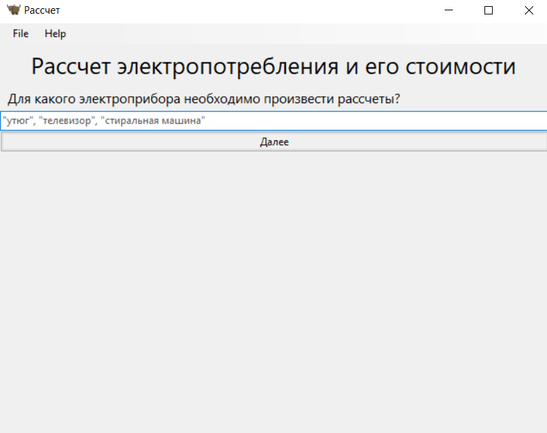
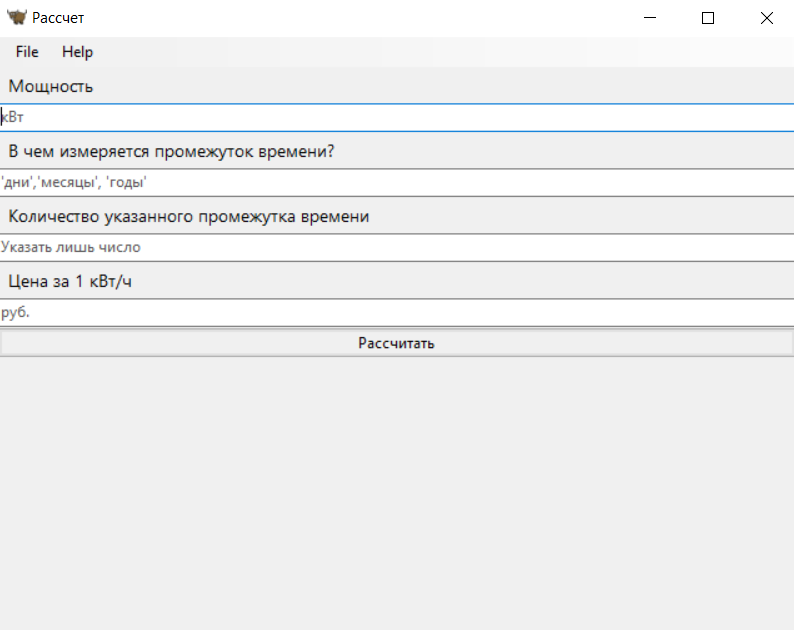
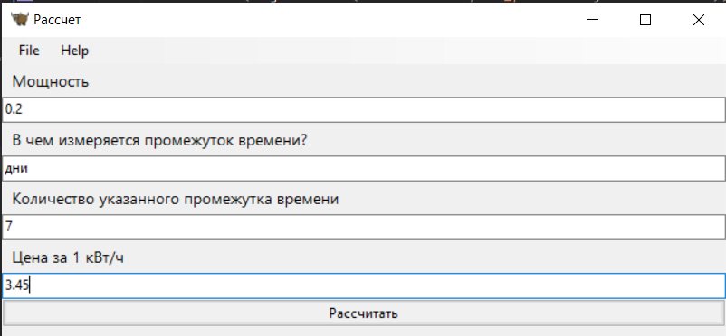
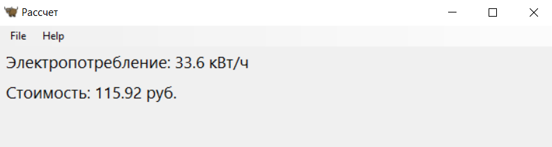
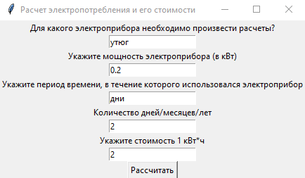
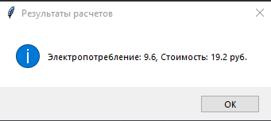
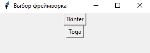
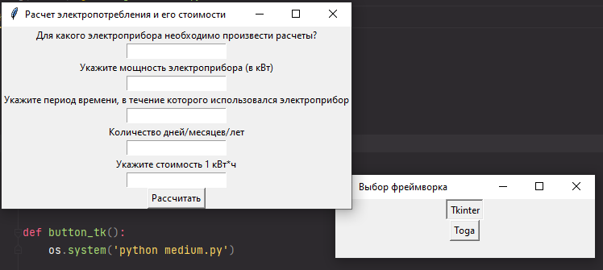
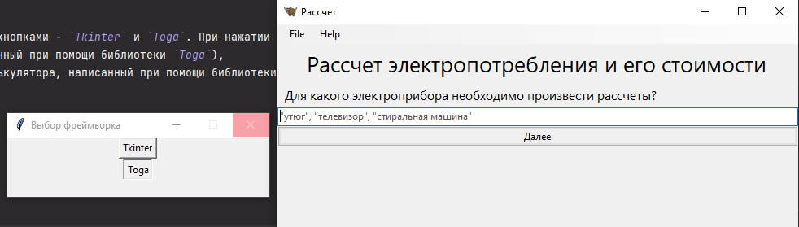

# Прог. Лабораторная работа №12
## Задание:
По своему варианту задания и GUI фреймворка создать пакет, содержащий 3 модуля, и подключить его к основной программе. 
Основная программа должна предоставлять:  
  - графический пользовательский интерфейс с возможностями ввода требуемых параметров и отображения результатов расчета,
  - возможность сохранить результаты в отчет формата ```.doc``` и ```.xls``` (например, пакеты ```python-docx``` и ```openpyxl```).

### Medium
- Реализовать возможность быстрой смены GUI фреймворка

### Мой вариант:   

7. GUI фреймворк - Toga    
   Бытовая техника
   - утюг
   - телевизор
   - стиральная машина
     Расчет потребления электроэнергии и стоимости использования прибора за заданный период

## Ход работы
В папке к лабораторной работе №12 был создан пакет ```modules``` с модулями ```iron_mod```, ```tv_mod```, ```washing_machine_mod```.
Эти модули предназначены для рассчета потребления электроприборами и стоимости использования прибора за
заданный период. Код:

```Python
class Calc:
    def __init__(self, usage_time, cost, n, power):
        self.usage_time = usage_time
        self.cost = cost
        self.n = n
        self.power = power

    def power_consumption(self):
        self.p_c = 1
        if self.usage_time == "дни":
            self.p_c = self.power * (24 * self.n)
        elif self.usage_time == 'месяцы':
            self.p_c = self.power * (24 * 30 * self.n)
        elif self.usage_time == 'годы':
            self.p_c = self.power * (24 * 30 * 12 * self.n)
        return self.p_c

    def price(self):
        p = self.cost * self.p_c
        return p
```

В файле ```lab.py``` было создано приложение на основе GUI фреймворка Toga. Код:

```Python
import toga
from lab_12.modules import tv_mod, washing_machine_mod, iron_mod
from toga.style.pack import COLUMN, Pack


class My_App(toga.App):

    def startup(self):
        main_box = toga.Box(style=Pack(direction=COLUMN))

        main_box.add(toga.Label("Рассчет электропотребления и его стоимости", style=Pack(padding=5, text_align='center',
                                                                                         font_size=20)))
        main_box.add(toga.Label("Для какого электроприбора необходимо произвести рассчеты?", style=Pack(padding=5,
                                                                                                        font_size=12)))
        main_box.add(toga.TextInput(placeholder='"утюг", "телевизор", "стиральная машина"',
                                    on_change=self.widget_value))  # введенное слово принимает функция widget_value
        main_box.add(
            toga.Button('Далее', on_press=self.next_window))  # при нажатии кнопки вызывается функция next_window

        self.main_window = toga.MainWindow()
        self.main_window.content = main_box
        self.main_window.show()

    def widget_value(self, widget):
        self.wv = widget.value

    def next_window(self, widget):
        w_values = ['утюг', 'Утюг', 'стиральная машина', 'Стиральная машина', 'телевизор', 'Телевизор']
        if widget.text == 'Далее' and (self.wv in w_values):
            self.to_input_values()

    # создает окно, в котором пользователь вводит необходимые для рассчета данные, их получает функция received_values
    def to_input_values(self):
        box = toga.Box(style=Pack(direction=COLUMN))
        box.add(toga.Label("Мощность", style=Pack(padding=5, font_size=10)))
        box.add(toga.TextInput(placeholder='кВт', on_change=self.received_values))

        box.add(toga.Label("В чем измеряется промежуток времени?",
                           style=Pack(padding=5, font_size=10)))
        box.add(toga.TextInput(placeholder="'дни','месяцы', 'годы'", on_change=self.received_values))

        box.add(toga.Label("Количество указанного промежутка времени", style=Pack(padding=5, font_size=10)))
        box.add(toga.TextInput(placeholder='Указать лишь число', on_change=self.received_values))

        box.add(toga.Label("Цена за 1 кВт/ч", style=Pack(padding=5, font_size=10)))
        box.add(toga.TextInput(placeholder='руб.', on_change=self.received_values))

        box.add(toga.Button('Рассчитать', on_press=self.calculation))

        self.main_window.content = box

    def received_values(self, widget):
        if widget.placeholder == 'кВт':
            self.power = float(widget.value)
        elif widget.placeholder == "'дни','месяцы', 'годы'":
            self.usage_time = widget.value
        elif widget.placeholder == 'Указать лишь число':
            self.n = int(widget.value)
        elif widget.placeholder == 'руб.':
            self.cost = float(widget.value)

    # производит расчеты, пользуясь подключенными для этого модулями iron_mod, tv_mod, washing_machine_mod выводит их
    # в новом созданном окне
    def calculation(self, *args, **kwargs):
        global res, r
        box = toga.Box(style=Pack(direction=COLUMN))
        if self.wv == 'утюг':
            c = iron_mod.Calc(self.usage_time, self.cost, self.n, self.power)
            r = c.power_consumption()
            res = c.price()
        elif self.wv == 'стиральная машина':
            c = washing_machine_mod.Calc(self.usage_time, self.cost, self.n, self.power)
            r = c.power_consumption()
            res = c.price()
        elif self.wv == 'телевизор':
            c = tv_mod.Calc(self.usage_time, self.cost, self.n, self.power)
            r = c.power_consumption()
            res = c.price()

        box.add(toga.Label(f"Электропотребление: {r} кВт/ч", style=Pack(padding=5, font_size=14)))
        box.add(toga.Label(f"Стоимость: {res} руб.", style=Pack(padding=5, font_size=14)))

        self.main_window.content = box


def main():
    return My_App("Рассчет", "org.beeware.toga.tutorial")


if __name__ == "__main__":
    main().main_loop()
```
## Запуск приложения

Начальное меню:    
   

Вводим одно из указанных в поле ввода значений, и, после нажатия кнопки "Далее", сменяется окно:   
   
   
Указываем все необходимые значения. Нажимаем кнопку "Рассчитать" и создается следующее окно, 
в котором указываются результаты рассчета.   
       
Результаты рассчета:  


## Используемые материалы: 
[BeeWare Tutorial](https://docs.beeware.org/en/latest/index.html)   
[Using Toga/Briefcase to Write a Simple Python GUI](https://www.depotanalytics.co/post/using-toga-briefcase-to-write-a-simple-python-gui)   
[Simple Toga Hangman App](https://github.com/Depot-Analytics/toga-hangman)  

## Medium
Для того чтобы реализовать быстрый переход между фреймворками, был дополнительно написан тот же самый калькулятор, но при
помощи библиотеки `Tkinter`.

Код:   
```Python
import tkinter as tk
from tkinter import messagebox
from modules import iron_mod, tv_mod, washing_machine_mod

# Создание главного окна приложения
root = tk.Tk()
root.title("Расчет электропотребления и его стоимости")


def calculating():
    e_app_val = str(e_app_entry.get())
    power_val = float(power_entry.get())
    usage_time_val = usage_time_entry.get()
    n_val = int(n_entry.get())
    cost_val = float(cost_entry.get())
    usage_time = usage_time_val
    cost = cost_val
    n = n_val
    power = power_val
    if e_app_val == 'утюг':
        print('ok')
        c = iron_mod.Calc(usage_time, cost, n, power)
        r = c.power_consumption()
        res = c.price()
        m = f'Электропотребление: {round(r, 2)}, Cтоимость: {round(res, 2)} руб.'
        return messagebox.showinfo('Результаты расчетов', '{}'.format(m))
    elif e_app_val == 'телевизор':
        c = tv_mod.Calc(usage_time, cost, n, power)
        r = c.power_consumption()
        res = c.price()
        m = f'Электропотребление: {round(r, 2)}, Cтоимость: {round(res, 2)} руб.'
        return messagebox.showinfo('Результаты расчетов', '{}'.format(m))
    elif e_app_val == 'стиральная машина':
        c = washing_machine_mod.Calc(usage_time, cost, n, power)
        r = c.power_consumption()
        res = c.price()
        m = f'Электропотребление: {round(r, 2)}, Cтоимость: {round(res, 2)} руб.'
        return messagebox.showinfo('Результаты расчетов', '{}'.format(m))


# Создание элементов интерфейса
e_app_label = tk.Label(root, text="Для какого электроприбора необходимо произвести расчеты?")
e_app_entry = tk.Entry(root)

power_label = tk.Label(root, text="Укажите мощность электроприбора (в кВт)")
power_entry = tk.Entry(root)

usage_time_label = tk.Label(root, text="Укажите период времени, в течение которого использовался электроприбор")
usage_time_entry = tk.Entry(root)

n_label = tk.Label(root, text="Количество дней/месяцев/лет")
n_entry = tk.Entry(root)

cost_label = tk.Label(root, text="Укажите стоимость 1 кВт*ч")
cost_entry = tk.Entry(root)

calc_button = tk.Button(root, text="Рассчитать", command=calculating)

# Размещение элементов на главном окне
e_app_label.pack()
e_app_entry.pack()
power_label.pack()
power_entry.pack()
usage_time_label.pack()
usage_time_entry.pack()
n_label.pack()
n_entry.pack()
cost_label.pack()
cost_entry.pack()

calc_button.pack()

# Запуск главного цикла приложения
root.mainloop()
```
При запуске калькулятора на `Tkinter` появляется окно, где пользователю предлагается ввести все необходимые для расчетов данные:    


После нажатия кнопки "Рассчитать" возникает окно с результатами расчетов:   


Далее в отдельном файле `choosing_a_framework.py` был написан код для реализации быстрого перехода между фреймворками, 
тоже при помощи библиотеки `Tkinter`, а также библиотеки `os` для запуска необходимых файлов.   

Код:    
```Python
import os
import tkinter as tk

root = tk.Tk()
root.title('Выбор фреймворка')


def button_toga():
    os.system('python lab.py')


def button_tk():
    os.system('python medium.py')


tk_button = tk.Button(root, text="Tkinter", command=button_tk)
toga_button = tk.Button(root, text="Toga", command=button_toga)

tk_button.pack()
toga_button.pack()

root.mainloop()
```

При запуске этого кода возникает окно с двумя кнопками - `Tkinter` и `Toga`. При нажатии кнопок запускается либо файл `lab.py` 
(в котором содержится код калькулятора, написанный при помощи библиотеки `Toga`), 
либо `medium.py` (в котором содержится код калькулятора, написанный при помощи библиотеки `Tkinter`), в зависимости от того, какая кнопка была нажата.   

Окно с кнопками:    


Нажимаем кнопку `Tkinter`:   


Нажимаем кнопку `Toga`:   
