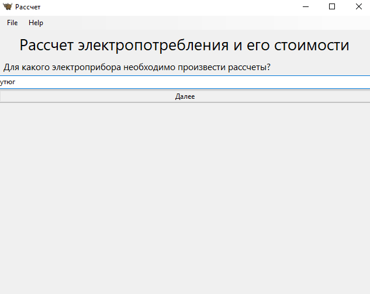
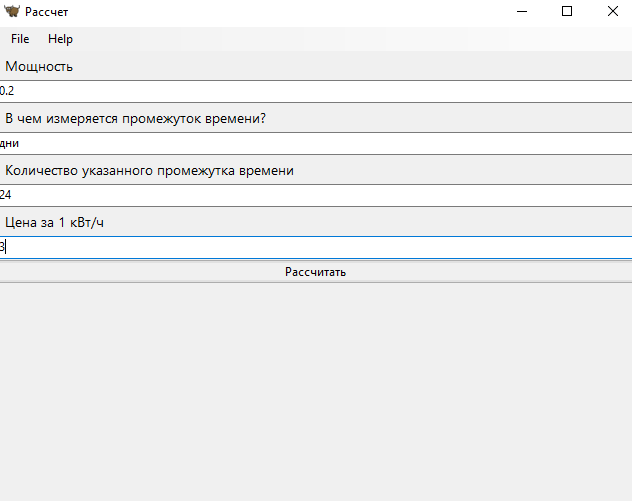
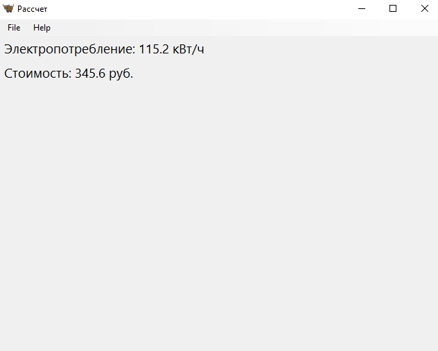

# Прог. Лабораторная работа №13
## Задание
Переписать свой вариант лабораторной работы №12 с использованием классов и объектов.

В коде должны присутствовать:
- абстрактный базовый класс и соответствующие декораторы для методов
- иерархия наследования
- managed-атрибуты
- минимум 2 dunder-метода у подклассов

## Ход работы:

Абстрактный базовый класс помещен в папку с модулями ```modules``` и применяется к ним же:
```Python
from abc import ABC, abstractmethod


class Appliance(ABC):
    def __init__(self, power, usage_time, cost, n):
        self.power = power
        self.usage_time = usage_time
        self.cost = cost
        self.n = n

    @abstractmethod
    def power_consumption(self, power, usage_time, n):
        pass

    @abstractmethod
    def price(self, cost):
        pass

    def __str__(self):
        return f"{self.__class__.__name__}"

    def __repr__(self):
        return f"{self.__class__.__name__}(power={self.power})"
```

Пакет ```modules``` содержит модули ```iron_mod```, ```tv_mod```, ```washing_machine_mod```.
Эти модули предназначены для рассчета потребления электроприборами и стоимости использования прибора за
заданный период. Код:

```Python
from appliance import Appliance


class Calc(Appliance):
    def power_consumption(self, power, usage_time, n):
        self.p_c = 1
        if usage_time == "дни":
            self.p_c = power * (24 * n)
        elif usage_time == 'месяцы':
            self.p_c = power * (24 * 30 * n)
        elif usage_time == 'годы':
            self.p_c = power * (24 * 30 * 12 * n)
        return self.p_c

    def price(self, cost):
        p = cost * self.p_c
        return p
```

В файле ```lab.py``` было создано приложение на основе GUI фреймворка Toga. Код:
```Python
import toga
from modules import iron_mod
from modules import tv_mod, washing_machine_mod
from toga.style.pack import COLUMN, Pack


class My_App(toga.App):

    def startup(self):
        main_box = toga.Box(style=Pack(direction=COLUMN))

        main_box.add(toga.Label("Рассчет электропотребления и его стоимости", style=Pack(padding=5, text_align='center',
                                                                                         font_size=20)))
        main_box.add(toga.Label("Для какого электроприбора необходимо произвести рассчеты?", style=Pack(padding=5,
                                                                                                        font_size=12)))
        main_box.add(toga.TextInput(placeholder='"утюг", "телевизор", "стиральная машина"',
                                    on_change=self.widget_value))   # введенное слово принимает функция widget_value
        main_box.add(toga.Button('Далее', on_press=self.next_window))  # при нажатии кнопки вызывается функция next_window

        self.main_window = toga.MainWindow()
        self.main_window.content = main_box
        self.main_window.show()

    def widget_value(self, widget):
        self.wv = widget.value

    def next_window(self, widget):
        w_values = ['утюг', 'Утюг', 'стиральная машина', 'Стиральная машина', 'телевизор', 'Телевизор']
        if widget.text == 'Далее' and (self.wv in w_values):
            self.to_input_values()

    # создает окно, в котором пользователь вводит необходимые для рассчета данные, их получает функция received_values
    def to_input_values(self):
        box = toga.Box(style=Pack(direction=COLUMN))
        box.add(toga.Label("Мощность", style=Pack(padding=5, font_size=10)))
        box.add(toga.TextInput(placeholder='кВт', on_change=self.received_values))

        box.add(toga.Label("В чем измеряется промежуток времени?",
                           style=Pack(padding=5, font_size=10)))
        box.add(toga.TextInput(placeholder="'дни','месяцы', 'годы'", on_change=self.received_values))

        box.add(toga.Label("Количество указанного промежутка времени", style=Pack(padding=5, font_size=10)))
        box.add(toga.TextInput(placeholder='Указать лишь число', on_change=self.received_values))

        box.add(toga.Label("Цена за 1 кВт/ч", style=Pack(padding=5, font_size=10)))
        box.add(toga.TextInput(placeholder='руб.', on_change=self.received_values))

        box.add(toga.Button('Рассчитать', on_press=self.calculation))

        self.main_window.content = box

    def received_values(self, widget):
        if widget.placeholder == 'кВт':
            self.power = float(widget.value)
        elif widget.placeholder == "'дни','месяцы', 'годы'":
            self.usage_time = widget.value
        elif widget.placeholder == 'Указать лишь число':
            self.n = int(widget.value)
        elif widget.placeholder == 'руб.':
            self.cost = float(widget.value)

    # производит расчеты, пользуясь подключенными для этого модулями iron_mod, tv_mod, washing_machine_mod выводит их
    # в новом созданном окне
    def calculation(self, *args, **kwargs):
        global res, r
        box = toga.Box(style=Pack(direction=COLUMN))
        if self.wv == 'утюг':
            c = iron_mod.Calc(self.usage_time, self.cost, self.n, self.power)
            r = c.power_consumption(usage_time='дни', n=24, power=0.2)
            res = c.price(cost=3)
        elif self.wv == 'стиральная машина':
            c = washing_machine_mod.Calc(self.usage_time, self.cost, self.n, self.power)
            r = c.power_consumption(usage_time='дни', n=24, power=0.2)
            res = c.price(cost=3)
        elif self.wv == 'телевизор':
            c = tv_mod.Calc(self.usage_time, self.cost, self.n, self.power)
            r = c.power_consumption(usage_time='дни', n=24, power=0.2)
            res = c.price(cost=3)

        box.add(toga.Label(f"Электропотребление: {r} кВт/ч", style=Pack(padding=5, font_size=14)))
        box.add(toga.Label(f"Стоимость: {round(res, 2)} руб.", style=Pack(padding=5, font_size=14)))

        self.main_window.content = box


def main():
    return My_App("Рассчет", "org.beeware.toga.tutorial")


if __name__ == "__main__":
    main().main_loop()
```

## Запуск приложения:

Начальное меню:    
 

Вводим одно из указанных в поле ввода значений, и, после нажатия кнопки "Далее", сменяется окно:   
  
   
Указываем все необходимые значения. Нажимаем кнопку "Рассчитать" и создается следующее окно, 
в котором указываются результаты рассчета.   
Результаты рассчета:  
