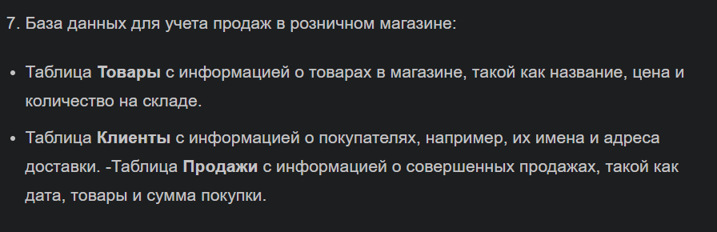
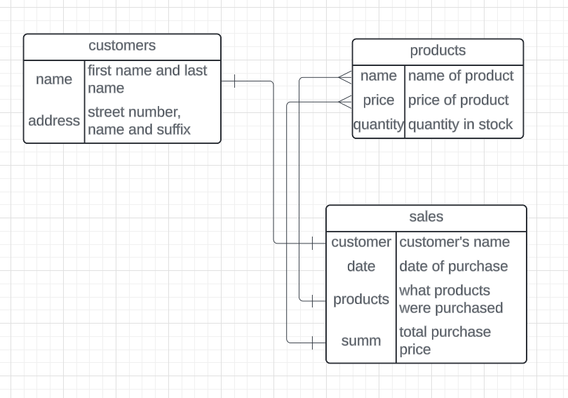
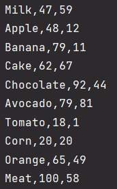
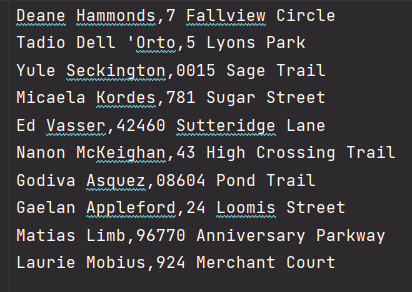
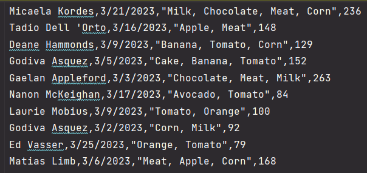
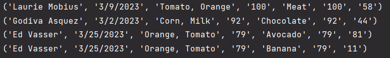
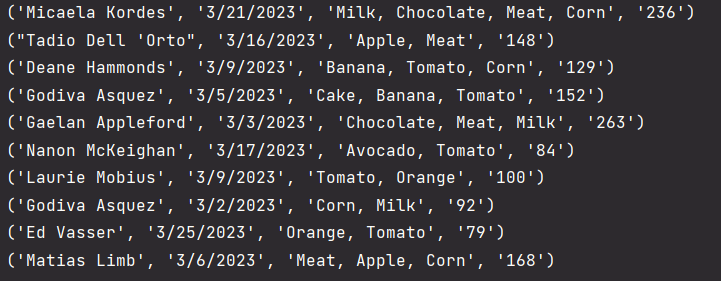
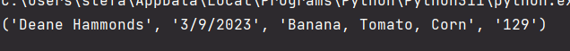
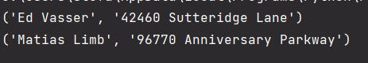

## Прог. Лабораторная работа №14
### Задание:
1. Спроектировать БД с использованием crow's foot notation.
2. Создать таблицы БД и заполнить данными
3. Написать несколько запросов для выборки данных из всех таблиц
4. Оформить отчет ```README.md```, который должен содержать:
    - условия задач
    - описание проделанной работы
    - скриншоты результатов
    - ссылки на используемые материалы

### Ход работы:
Мой вариант:


1. Спроектированное с использованием crow's foot notation БД:   
    

2. Таблицы БД были созданы с помощью сервиса [Mockaroo](https://www.mockaroo.com/)   
   - Таблица ```products```   
   
   - Таблица ```customers```  
   
   - Таблица ```sales```   
   

3. Код:

```Python
import sqlite3, csv

con = sqlite3.connect("my_database.db")
cur = con.cursor()

# создание таблиц
# cur.execute("CREATE TABLE customers (name, address);")
# cur.execute("CREATE TABLE products (product, price, quantity);")
# cur.execute("CREATE TABLE sales (customer, date, products, summ);")

file1 = open('customers.csv')
file2 = open('products.csv')
file3 = open('sales.csv')

contents1 = csv.reader(file1)
contents2 = csv.reader(file2)
contents3 = csv.reader(file3)

# # расположение данных в таблицах

# insert_records = "INSERT INTO customers (name, address) VALUES(?, ?)"
# cur.executemany(insert_records, contents1)

# insert_records = "INSERT INTO products (product, price, quantity) VALUES(?, ?, ?)"
# cur.executemany(insert_records, contents2)

# insert_records = "INSERT INTO sales (customer, date, products, summ) VALUES(?, ?, ?, ?)"
# cur.executemany(insert_records, contents3)

# установление связей между таблицами
cur.execute('SELECT customers.name FROM customers JOIN sales ON (customers.name = sales.customer)')
cur.execute('SELECT sales.products FROM sales JOIN products ON (sales.products = products.product)')
cur.execute('SELECT sales.summ FROM sales JOIN products ON (sales.summ = products.price)')

# запросы
# select_all = "SELECT * FROM sales WHERE sales.products = 'Banana, Tomato, Corn'"
# rows = cur.execute(select_all).fetchall()

select_all = "SELECT * FROM customers WHERE customers.name = 'Ed Vasser' OR customers.name = 'Matias Limb'"
rows = cur.execute(select_all).fetchall()

# select_all = "SELECT * FROM sales, products WHERE sales.summ = products.price"
# rows = cur.execute(select_all).fetchall()

# select_all = 'SELECT * FROM sales'
# rows = cur.execute(select_all).fetchall()

for r in rows:
    print(r)

con.commit()
con.close()
```

Выполнение запросов:

"Выбрать строки из sales и products, если сумма покупки равна цене какого-либо продукта"
```Python
select_all = "SELECT * FROM sales, products WHERE sales.summ = products.price"
rows = cur.execute(select_all).fetchall()
```
Вывод: 


"Выбрать все из sales"
```Python
select_all = 'SELECT * FROM sales'
rows = cur.execute(select_all).fetchall()
```

Вывод:


"Выбрать строки из sales, если список продуктов Banana, Tomato, Corn"
```Python
select_all = "SELECT * FROM sales WHERE sales.products = 'Banana, Tomato, Corn'"
rows = cur.execute(select_all).fetchall()
```
Вывод:


"Выбрать строки из customers, если имя покупателя Ed Vasser или Matias Limb"
```Python
select_all = "SELECT * FROM customers WHERE customers.name = 'Ed Vasser' OR customers.name = 'Matias Limb'"
rows = cur.execute(select_all).fetchall()
```

Вывод:
