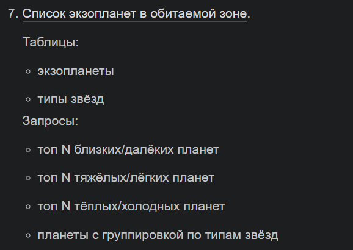
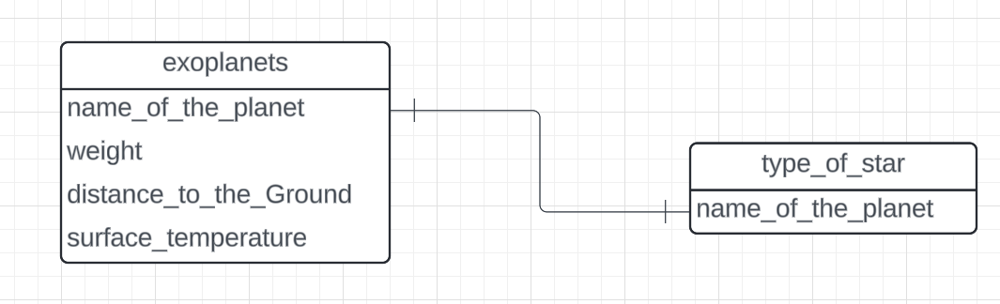

## Прог. Лабораторная работа №15

### Задание
1. Спроектировать БД с использованием crow's foot notation.
2. Реализовать парсер для сбора данных с веб-страницы.
3. С помощью DB API создать таблицы БД и заполнить их данными, полученными с помощью парсера.
4. Написать запросы для выборки данных из БД.
5. Оформить отчет ```README.md```, который должен содержать:
    - условия задач
    - описание проделанной работы
    - скриншоты результатов
    - ссылки на используемые материалы

### Ход работы:
Мой вариант:    


1. Спроектированное с использованием crow's foot notation БД    

2. 