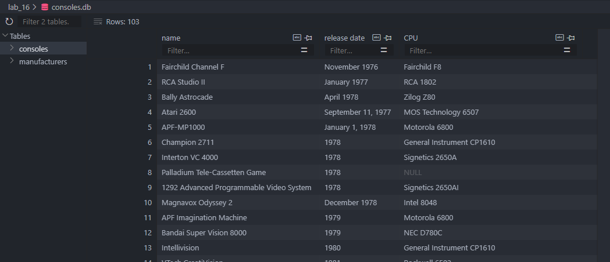
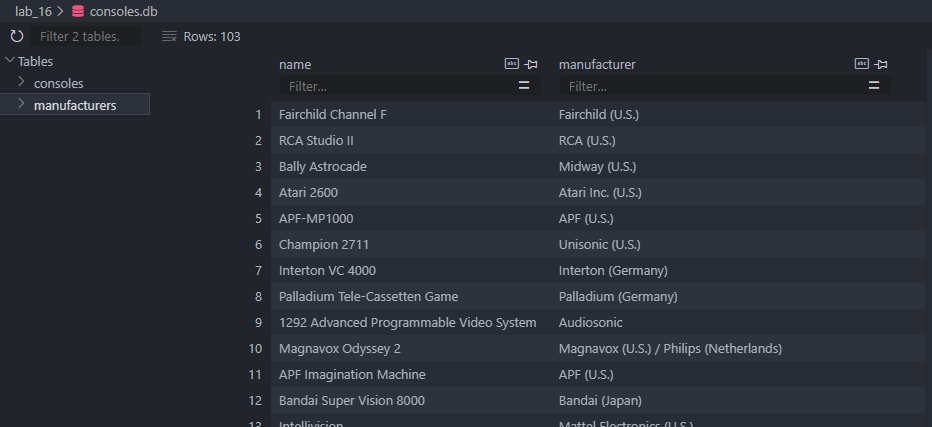
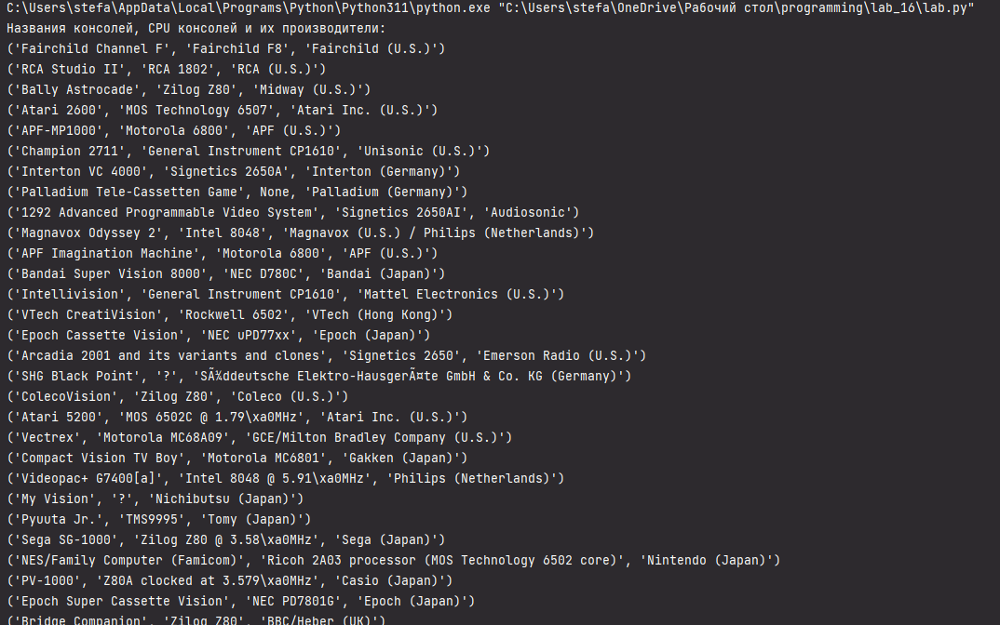
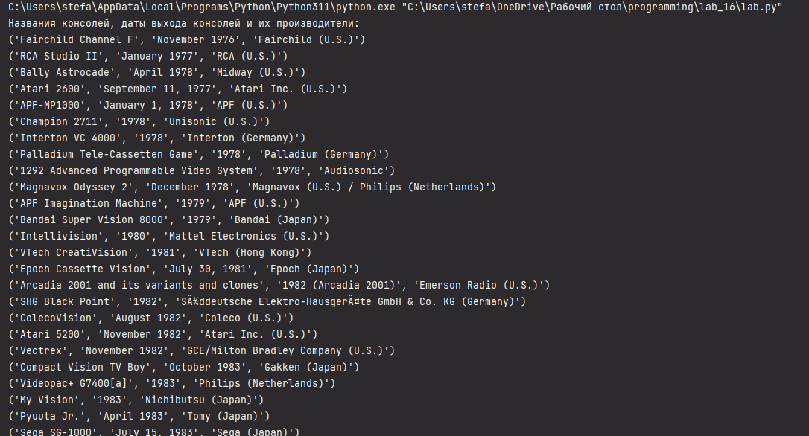
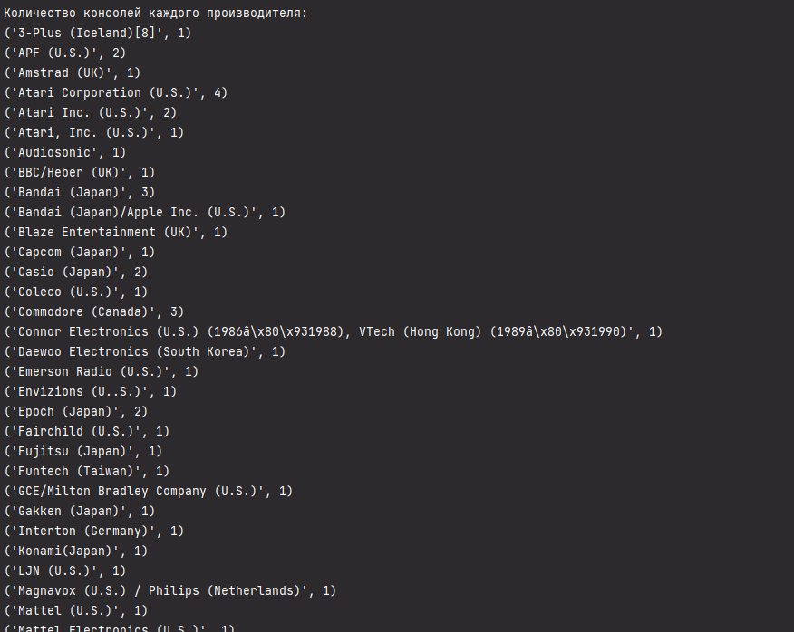

# Прог. Лабораторная работа №16
## Задание
1. Реализовать парсер с использованием Selenium для сбора данных с веб-страницы.
2. Создать таблицы БД и заполнить их данными, полученными с помощью парсера.
3. Написать запросы для выборки данных из БД с использованием PyPika Queru Builder
    - 2 запроса с JOIN
    - запрос с расчетом статистики/группировкой/агрегирующими функциями
4. Оформить отчет `README.md`

## Ход работы

Для парсинга была выбрана [страница из Википедии](https://en.wikipedia.org/wiki/Home_video_game_console).

Код:
```Python
import pandas as pd
import wikipedia as wp
import sqlite3
from pypika import Query, Table, functions as fn

# Получаем HTML-страницу из Википедии
html = wp.page("Home_video_game_console").html().encode("UTF-8")

df = pd.read_html(html)[1]

# Создаем таблицы
consoles_df = df.iloc[:, [0, 1, 4]].rename(columns=lambda x: x.replace(']', '').replace('[', '').strip())  # Название, Дата выхода, CPU
consoles_df.columns = ['name', 'release_date', 'CPU']  # Переименовываем столбцы

manufacturers_df = df.iloc[:, [0, 2]].rename(columns=lambda x: x.replace(']', '').replace('[', '').strip())  # Название, производитель
manufacturers_df.columns = ['name', 'manufacturer']  # Переименовываем столбцы

# Создаем соединение с базой данных SQLite
conn = sqlite3.connect("consoles.db")

# Создаем таблицы
consoles_df.to_sql("consoles", conn, if_exists="replace", index=False)
manufacturers_df.to_sql("manufacturers", conn, if_exists="replace", index=False)

# Закрываем соединение
conn.close()

# Подключение к базе данных
conn = sqlite3.connect("consoles.db")
cursor = conn.cursor()

consoles = Table("consoles")
manufacturers = Table("manufacturers")

# 1. Запрос с JOIN для получения названий консолей, CPU консолей и производителей
query = (
    Query.from_(consoles)
    .join(manufacturers)
    .on(consoles.name == manufacturers.name)
    .select(consoles.name, consoles.CPU, manufacturers.manufacturer)
)
cursor.execute(str(query))
print("Названия консолей, CPU консолей и их производители:")
for row in cursor.fetchall():
    print(row)

# 2. Запрос с JOIN для получения названий консолей, дат выхода консолей и производителей
query = (
    Query.from_(consoles)
    .join(manufacturers)
    .on(consoles.name == manufacturers.name)
    .select(consoles.name, consoles.release_date, manufacturers.manufacturer)
)
cursor.execute(str(query))
print("Названия консолей, даты выхода консолей и их производители:")
for row in cursor.fetchall():
    print(row)

# 3. Запрос с группировкой и подсчетом количества консолей каждого производителя
query = (
    Query.from_(manufacturers)
    .select(manufacturers.manufacturer, fn.Count(manufacturers.name).as_("consoles_count"))
    .groupby(manufacturers.manufacturer)
)
cursor.execute(str(query))
print("\nКоличество консолей каждого производителя:")
for row in cursor.fetchall():
    print(row)

# Закрытие соединения с базой данных
conn.close()
```
Получившиеся таблицы:   
   
    

## Выполнение запросов

### Запрос 1

```Python
# 1. Запрос с JOIN для получения названий консолей, CPU консолей и производителей
query = (
    Query.from_(consoles)
    .join(manufacturers)
    .on(consoles.name == manufacturers.name)
    .select(consoles.name, consoles.CPU, manufacturers.manufacturer)
)
cursor.execute(str(query))
print("Названия консолей, CPU консолей и их производители:")
for row in cursor.fetchall():
    print(row)
```

Вывод:   


### Запрос 2

```Python
# 2. Запрос с JOIN для получения названий консолей, дат выхода консолей и производителей
query = (
    Query.from_(consoles)
    .join(manufacturers)
    .on(consoles.name == manufacturers.name)
    .select(consoles.name, consoles.release_date, manufacturers.manufacturer)
)
cursor.execute(str(query))
print("Названия консолей, даты выхода консолей и их производители:")
for row in cursor.fetchall():
    print(row)
```

Вывод:  


### Запрос 3

```Python
# 3. Запрос с группировкой и подсчетом количества консолей каждого производителя
query = (
    Query.from_(manufacturers)
    .select(manufacturers.manufacturer, fn.Count(manufacturers.name).as_("consoles_count"))
    .groupby(manufacturers.manufacturer)
)
cursor.execute(str(query))
print("\nКоличество консолей каждого производителя:")
for row in cursor.fetchall():
    print(row)
```

Вывод:  

