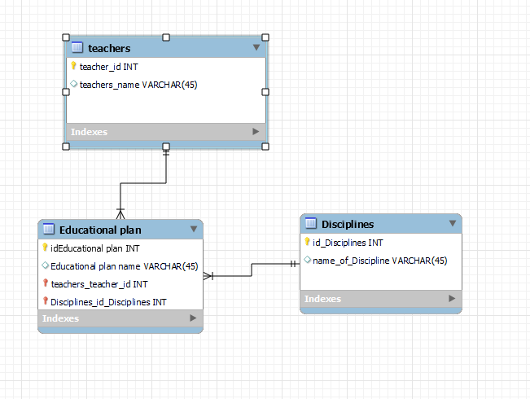

# Прог. Лабораторная работа №17
## Задание:
1. Спроектировать БД с использованием crow’s foot notation.
2. Написать модели данных, создать и заполнить БД с помощью SQLAlchemy.
3. Написать запросы для выборки и анализа данных из БД.
4. Оформить отчет в `readme.md`.

## Мой вариант


## Ход работы

Спроектированная при помощи crow’s foot notation БД:    

      

Модели данных, заполнение БД, запросы:    

```Python
from sqlalchemy import Column, Integer, String, ForeignKey
from sqlalchemy.orm import relationship, declarative_base
from sqlalchemy import create_engine
from sqlalchemy.orm import sessionmaker

Base = declarative_base()


class Teacher(Base):
    __tablename__ = 'teachers'
    id = Column(Integer(), primary_key=True)
    name = Column(String())


class Discipline(Base):
    __tablename__ = 'disciplines'
    id = Column(Integer(), primary_key=True)
    name_of_the_discipline = Column(String())


class EducationalPlan(Base):
    __tablename__ = 'educational_plans'
    id = Column(Integer(), primary_key=True)
    name_of_the_plan = Column(String())
    discipline_id = Column(Integer(), ForeignKey('disciplines.id'))
    teacher_id = Column(Integer(), ForeignKey('teachers.id'))
    teacher = relationship('Teacher')
    discipline = relationship('Discipline')


# создание бд
engine = create_engine('sqlite:///university.db')
Base.metadata.create_all(engine)

Session = sessionmaker(bind=engine)
session = Session()

# Заполнение данными
discipline1 = Discipline(name_of_the_discipline="Алгебра")
discipline2 = Discipline(name_of_the_discipline="Физика")
discipline3 = Discipline(name_of_the_discipline='История')

teacher1 = Teacher(name="Иванов И.И.")
teacher2 = Teacher(name="Петров П.П.")

ep1 = EducationalPlan(name_of_the_plan="План 1", discipline=discipline1, teacher=teacher1)
ep2 = EducationalPlan(name_of_the_plan="План 2", discipline=discipline2, teacher=teacher1)
ep3 = EducationalPlan(name_of_the_plan='План 3', discipline=discipline3, teacher=teacher2)

# Запросы

# вывод всех учителей и дисциплин
# teachers_with_disciplines = session.query(EducationalPlan.id, Teacher.name, Discipline.name_of_the_discipline).join(Discipline).join(Teacher).all()
# for i in range(0, 3):
#     print(f'ID учебного плана: {teachers_with_disciplines[i][0]}, Преподаватель: {teachers_with_disciplines[i][1]}, Дисциплина: {teachers_with_disciplines[i][2]}')

# вывод всех учебных планов и дисциплин, связанных с ними
# educational_plans_with_disciplines = session.query(EducationalPlan.name_of_the_plan, Discipline.name_of_the_discipline).join(Discipline).filter(EducationalPlan.discipline_id == Discipline.id).all()
# for i in range(0, 3):
#     print(f'Наименование учебного плана: {educational_plans_with_disciplines[i][0]}, Дисциплина: {educational_plans_with_disciplines[i][1]}')

# вывод тех дисциплин, которые ведет Иванов И.И.
teachers1_disciplines = session.query(EducationalPlan.id, Teacher.name, Discipline.name_of_the_discipline).join(Discipline).join(Teacher).filter(Teacher.name == 'Иванов И.И.').all()
for i in range(0, 2):
    print(f'ID учебного плана: {teachers1_disciplines[i][0]}, ФИО преподавателя: {teachers1_disciplines[i][1]}, Дисциплина: {teachers1_disciplines[i][2]}')

session.add_all([discipline1, discipline2, discipline3])
session.add_all([teacher1, teacher2])
session.add_all([ep1, ep2, ep3])
session.commit()
session.close()
```

Выполнение запросов:     

Запрос 1    

```Python
# вывод всех учителей и дисциплин
teachers_with_disciplines = session.query(EducationalPlan.id, Teacher.name, Discipline.name_of_the_discipline).join(Discipline).join(Teacher).all()
for i in range(0, 3):
    print(f'ID учебного плана: {teachers_with_disciplines[i][0]}, Преподаватель: {teachers_with_disciplines[i][1]}, Дисциплина: {teachers_with_disciplines[i][2]}')
```

Вывод:    


Запрос 2   

```Python
# вывод всех учебных планов и дисциплин, связанных с ними
educational_plans_with_disciplines = session.query(EducationalPlan.name_of_the_plan, Discipline.name_of_the_discipline).join(Discipline).filter(EducationalPlan.discipline_id == Discipline.id).all()
for i in range(0, 3):
    print(f'Наименование учебного плана: {educational_plans_with_disciplines[i][0]}, Дисциплина: {educational_plans_with_disciplines[i][1]}')
```

Вывод:   


Запрос 3  

```Python
# вывод тех дисциплин, которые ведет Иванов И.И.
teachers1_disciplines = session.query(EducationalPlan.id, Teacher.name, Discipline.name_of_the_discipline).join(Discipline).join(Teacher).filter(Teacher.name == 'Иванов И.И.').all()
for i in range(0, 2):
    print(f'ID учебного плана: {teachers1_disciplines[i][0]}, ФИО преподавателя: {teachers1_disciplines[i][1]}, Дисциплина: {teachers1_disciplines[i][2]}')
```

Вывод:   


## Используемые материалы
[Создание схемы в SQLAlchemy ORM](https://pythonru.com/biblioteki/shemy-v-sqlalchemy-orm)