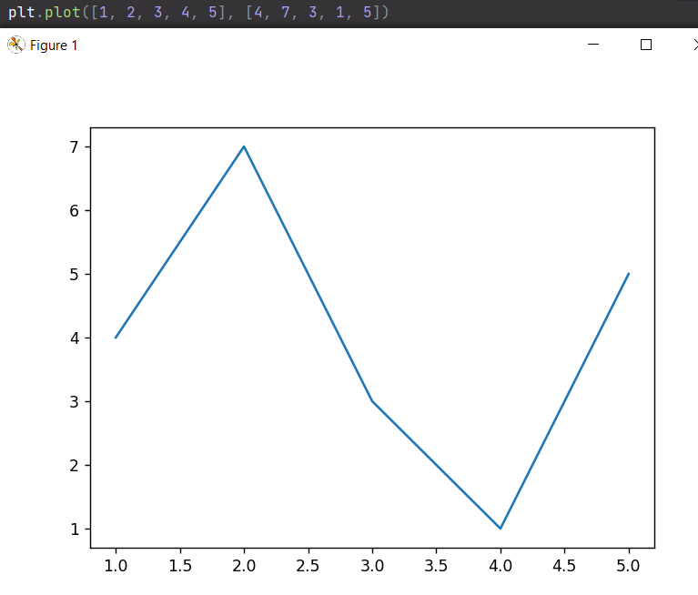

# Прог. Лабораторная работа №5
## Задание:
_Сложность:_ Rare
1. Создать в каталоге для данной ЛР в своем репозитории виртуальное окружение и установить в него ```matplotlib``` и ```numpy```.
Создать файл ```requirements.txt```.
2. Открыть книгу [Devpractice Team. Библиотека Matplotlib](https://evil-teacher.on.fleek.co/books/prog_pm/matplotlib.pdf)
и выполнить уроки 1-3.
3. Выбрать одну из неразрывных функций своего варианта из ЛР№2, построить
график этой функции и касательную к ней. Добавить на график
заголовок, подписи осей, легенду, сетку, а также аннотацию
к точке касания.
4. Оформить отчет в ```readme.md```, который должен содержать:
- графики, построенные во время выполнения уроков из книги
- объяснения процесса решения и график по заданию 4
5. Склонировать [репозиторий](https://github.com/still-coding/report_tool.git) рядом
со своим репозиторием. Изучить использование этого инструмента и создать pdf-версию
отчета из ```readme.md```. Добавить ее в репозиторий
     
## Ход работы:
Было создано виртуальное окружение и установлены библиотеки ```matplotlib``` и ```numpy```    
    
     
      
    
    
В книге [Devpractice Team. Библиотека Matplotlib](https://evil-teacher.on.fleek.co/books/prog_pm/matplotlib.pdf) изучены 1-3 уроки

Мой вариант:   


### Графики, построенные во время выполнения уроков 1-3:



### График по варианту:
```Python
import matplotlib.pylab as plt
import math

x = plt.arange(-1.0, 1.0, 0.1)
y = [math.exp(-2 * math.sin(i)) for i in x]

# касательная к функции. d - уравнение касательной, где
# (-2 * math.exp(-2 * math.sin(x0)) * math.cos(x0) = f'(x0),
# math.exp(-2 * math.sin(x0) = f(x0)
dy = []
x0 = 0
for i in x:
    d = ((-2 * math.exp(-2 * math.sin(x0)) * math.cos(x0)) * (i - x0)) + math.exp(-2 * math.sin(x0))
    dy.append(d)

plt.title('Graph')
plt.xlabel('x')
plt.ylabel('y')
plt.grid(True)
plt.plot(x, y, 'g-', lw=1, label='y = e^(-2 * sin(x))')
plt.plot(x, dy, 'r-', label='касательная к функции y')
plt.legend()
plt.annotate('точка касания', xy=(0, 1),  xycoords='data', xytext=(0, 2),
textcoords='data', arrowprops=dict(facecolor='y'))
plt.ylim([0, 5])
plt.show()
```


### График по заданию 4:


