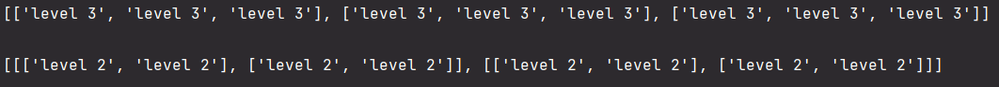
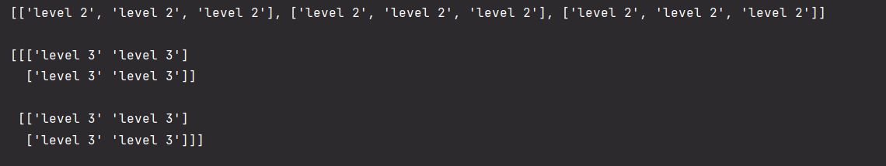
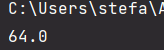
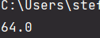

# Прог. Лабораторная работа №7
## Задание:
- Написать две функции для решения задач своего варианта (7) - с использованием рекурсии и без.
- Оформить  отчет в ```readme.md```, который должен содержать:
  - условия задач
  - описаниие проделанной работы
  - скриншоты результатов
  - ссылки на используемые материалы

### Мой вариант:

1. Функция для создания $n$-мерных массивов.
   примеры вывода:
   ```Python
   >>> create_n_dim_array(2, 3)
   [
       ['level 2', 'level 2', 'level 2'],
       ['level 2', 'level 2', 'level 2'],
       ['level 2', 'level 2', 'level 2']
   ]
   >>> create_n_dim_array(3, 2)
   [
       [
           ['level 3', 'level 3'],
           ['level 3', 'level 3'],
       ], 
       [
           ['level 3', 'level 3'],
           ['level 3', 'level 3'],
       ]
   ]
   ```
2. Функция для рассчета $y_k = b_k y_{k-1}$. $y_0 = 1$, $b_k = b_{k-1} x^2$, $b_0 = \frac{1}{2x}$, $x \neq 0$.

### Решение:

1. - решение с использованием рекурсии
     ```Python
     def create_n_dim_array(m, n):
         a = 0
         for i in range(n):
             a += 1
         string = f'level {a}'
         if m == 1:
             return [string] * n
         else:
             return [create_n_dim_array(m - 1, n)] * n
  
  
     print(create_n_dim_array(2, 3))
     print()
     print(create_n_dim_array(3, 2))
     ```
     Вывод:
     
     

   - без рекурсии     
     Нерекурсивная функция для многомерных массивов будет правильно работать
     только тогда, когда в ней прописаны случаи для конкретных, заранее
     определенных количеств измерений. 
     
     ```Python
     import numpy as np


     def create_n_dim_array(m, n):
         arr = []
         string = [f'level {m}']
         if m == 1:
             return string * n
         elif m == 2:
             for i in range(n):
                 arr.append(string * n)
             return arr
         elif m == 3:
             arr = np.full((n, n, n), string)
             return arr


     print(create_n_dim_array(2, 3))
     print()
     print(create_n_dim_array(3, 2))
     ```
     Вывод:
     
     

2. - решение с использованием рекурсии:
     ```Python
     def b(k, x):
         if k == 0:
            return 1.0 / (2.0 * x)
         bk = b(k-1, x) * x ** 2
         return bk


     def y(k, x):
         if x == 0:
             raise ValueError('x should not be 0')
         if k == 0:
             return 1
         yk = b(k, x) * y(k-1, x)
         return yk


     print(y(3, 2))
     ```
     Вывод:

     

   - без использования рекурсии
     ```Python
     def y(k, x):
         if x == 0:
             raise ValueError('x should not be 0')

         y_0 = 1
         b_0 = 1 / (2 * x)
         y_k = 0
         for i in range(1, k+1):
             b_k = b_0 * x**2
             y_k = b_k * y_0

             y_0 = y_k
             b_0 = b_k

         return y_k


     print(y(3, 2))
     ```
     Вывод:
     
     
