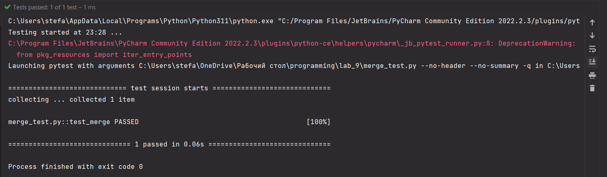

# Прог. Лабораторная работа №9

## Задание
1. Решить задачу своего варианта
2. Оформить отчет в ```readme.md```, который должен сожержать:
    - Условия задач
    - Описание проделанной работы
    - Скриншоты результатов
    - Ссылки на используемые материалы

Сложность medium:
- Написать тест для генератора с помощью pytest
## Мой вариант (7)

Генератор для объединения последовательностей по заданной стратегии.

## Решение
```Python
def merge(*iterables):
    generator = (iter(current) for current in iterables)
    iters = list(generator)
    while iters:
        for i in iters:
            try:
                yield i.__next__()
            except StopIteration:
                iters.remove(i)


s1 = [0, 1, 2, 3]
s2 = [4, 5, 6]
s3 = [7, 8, 9, 10]

print([*(i for i in merge(s1, s2, s3))])
```

Вывод:


## Medium
Тест проверяет правильность работы генератора
```Python
import pytest
from lab import merge, s1, s2, s3


def test_merge():
    expected_output = [0, 4, 7, 1, 5, 8, 2, 6, 9, 3, 10]
    assert list(merge(s1, s2, s3)) == expected_output
    assert list(merge([1, 4, 7], [2, 5, 8], [3, 6, 9])) == [1, 2, 3, 4, 5, 6, 7, 8, 9]
```

Вывод:    


## Используемые материалы

[Использование генераторов в Python](https://egorovegor.ru/python-generators/)

[Генераторы Python. Их создание и использование](https://pythonist.ru/generatory-python-ih-sozdanie-i-ispolzovanie/)