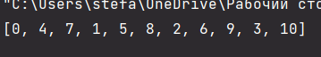

# Прог. Лабораторная работа №9

## Задание
1. Решить задачу своего варианта
2. Оформить отчет в ```readme.md```, который должен сожержать:
    - Условия задач
    - Описание проделанной работы
    - Скриншоты результатов
    - Ссылки на используемые материалы
    - 
## Мой вариант (7)

Генератор для объединения последовательностей по заданной стратегии.

## Решение
```Python
def merge(*iterables):
    generator = (iter(current) for current in iterables)
    iters = list(generator)
    while iters:
        for i in iters:
            try:
                yield i.__next__()
            except StopIteration:
                iters.remove(i)


s1 = [0, 1, 2, 3]
s2 = [4, 5, 6]
s3 = [7, 8, 9, 10]

print([*(i for i in merge(s1, s2, s3))])
```

Вывод:



## Используемые материалы

[Использование генераторов в Python](https://egorovegor.ru/python-generators/)

[Генераторы Python. Их создание и использование](https://pythonist.ru/generatory-python-ih-sozdanie-i-ispolzovanie/)